# MVP - Análise Fundamentalista de Ações Brasileiras

## 1. Introdução

Este projeto tem como objetivo desenvolver um pipeline de dados para coleta, tratamento, modelagem e análise de informações financeiras de empresas brasileiras.

O projeto utiliza dados históricos de ações obtidos na plataforma BRAPI, processados utilizando Python e Databricks, seguindo uma arquitetura medalhão de dados em camadas Bronze, Silver e Gold.

A BRAPI disponibiliza gratuitamente apenas quatro ações diferentes, de modo que elas foram selecionadas para a análise.

- PETR4 — Petrobras
- VALE3 — Vale
- ITUB4 — Itaú Unibanco
- MGLU3 — Magazine Luiza

O período de dados utilizado compreende 01/01/2020 a 31/12/2026.

A análise final busca aplicar critérios fundamentalistas às empresas selecionadas, utilizando indicadores de rentabilidade, crescimento, valuation, endividamento e distribuição de proventos.

---

## 2. Contexto de Negócios e Perguntas (Etapa 2 e 4.1)

### 2.1 Contexto do problema

O problema de negócio deste MVP consiste em organizar dados financeiros históricos de empresas brasileiras e transformá-los em informações estruturadas que permitam realizar uma análise fundamentalista.

A partir dos dados coletados, pretende-se avaliar diferentes características das empresas, como:

- rentabilidade;
- crescimento dos lucros;
- distribuição de dividendos e JCP;
- nível de endividamento;
- margem líquida;
- retorno sobre o patrimônio;
- relação entre preço e fundamentos;
- estimativas de preço teto e valor justo.

As empresas selecionadas pertencem a setores econômicos diferentes. Portanto, a comparação entre elas é utilizada como exercício de aplicação dos critérios definidos no MVP, mas normalmente a comparação técnica deve ser feita entre empresas de mesmo setor para selecionar ativos.

### 2.2 Perguntas de negócio

As principais perguntas que orientam a análise são:

1. As empresas estão pagando bons dividendos? Quais?
    
    fundamentação: A empresa deve ter um dividend yield de pelo menos 6%. Significa que do valor investido, ela paga pelo menos 6% desse valor ao ano de volta ao acionista. 

2. As empresas estão com boa margem de lucros? Quais?

    fundamentação: A margem líquida deve estar acima de 10%. Margem líquida se refere ao valor de quanto da receita da empresa é lucro.  E o ROE, retorno de lucro em relação aos investimentos também deve ser acima de 10%.

3. As empresas estão crescendo em lucros? Quais?

    fundamentação: É interessante que a empresa tenha lucros crescentes. Nem sempre uma empresa vai lucrar, mas é interessante que em uma linha de 5 anos, ela tenha conseguido lucrar mais no geral. 

4. Leva-se pouco tempo para recuperar o investimento nessas empresas?
    
    fundamentação: A métrica a considerar é o P/L (preço sobre lucro). Significa que dado certo lucro anual, eu levaria uma quantidade de anos para recuperar o valor investido. É interessante que seja uma baixa quantidade de anos.

5. As empresas passam no critério de Graham para preço, valor e lucro?

    fundamentação: Benjamin Graham definiu que o Preço do ativo deve ser até 1,5 o valor patrimonial (valor em patrimônios) e que preço deve ser até 15 vezes o lucro. No entanto ele aprendeu que não é bom analisar separadamente, então o critério é que o Preço / VP e o Preço / Lucro sejam multiplicados e que o resultado seja até 22,5. Dessa forma, o P/VP poderia ser compensado pelo P/L ou vice versa.

6. As empresas podem pagar as dívidas em poucos anos?

    fundamentação: Essa métrica é conseguida dividindo a dívida líquida da empresa pelo EBITDA (Lucros Antes de Juros, Impostos, Depreciação e Amortização). Basicamente seria quantos anos seriam necessários para pagar a dívida da empresa usando o caixa. É normal uma empresa possuir dívida, mas é interessante que ela tenha a capacidade de pagá-la em menos de 5 anos. 

7. As empresas estão passando do preço teto? Quais?

    fundamentação: Preço teto é uma métrica definida pela fórmula de Bazin, considera o dividendo (em reais) que a empresa paga no ano divido pelo rendimento que eu desejo em porcentagem. Dessa forma, se eu espero um rendimento de pelo menos 6% de uma empresa e se ela paga 1 real de dividendo por ano, o preço máximo que deve-se pagar é de R$ 16,70. Rendimentos maiores fazem o preço teto cair e a empresa pagadora de dividendos deve ter o custo por ação menor.   
8. As empresas estão no preço justo? Quais?

    fundamentação: Preço justo foi definido pelo Benjamin Graham, ele é uma boa métrica caso a empresa seja de crescimento e não de dividendos. Ele segue a equação: Raiz de (22,5 * Lucro Por Ação * VP por Ação). Ou seja, considera o lucro da empresa e o valor patrimonial. Os 22,5 é o valor limite de P/VP * P/L. Se fizesse uma análise dimensional, no fim a equação daria [P/A] Preço por Ação, considerando o limite ideal de 22,5.

9. Qual delas seria o melhor ativo para adquirir?

    fundamentação: No fim das contas, as métricas servem para um analista comparar ações e ver qual seria a mais interessante para compor seu portifólio naquele momento. Dito isso, o correto seria comparar ações de mesmos setores de mercado. No entanto, como a BRAPI disponibiliza apenas 4 ações, essa decisão será tomada meramente por questão de exercício.

As respostas são apresentadas na camada Gold do projeto e documentadas na seção **Análise de Dados (Etapa 4.5)**.

### 2.3 Dados brutos

Os dados utilizados no projeto foram obtidos por meio da BRAPI e coletados utilizando um script Python desenvolvido para o MVP.

Os ativos considerados são:

- PETR4
- VALE3
- ITUB4
- MGLU3

O período de coleta definido foi de 01/01/2020 a 31/12/2026.

Os dados brutos foram obtidos em diferentes conjuntos de informações, posteriormente armazenados em arquivos CSV.

Entre os conjuntos coletados estão:

| Conjunto de dados | Descrição |
|---|---|
| Cotações | Histórico de preços das ações |
| Estatísticas | Indicadores e informações de mercado |
| Dados financeiros | Indicadores financeiros e operacionais |
| Balanço patrimonial | Ativos, passivos e patrimônio líquido |
| Demonstração de resultados | Receitas, despesas e lucro |
| Fluxo de caixa | Entradas e saídas de caixa |
| Valor adicionado | Informações relacionadas à geração e distribuição de valor |
| Dividendos | Dividendos, JCP e demais eventos de proventos |

Os arquivos CSV são armazenados no Volume do Databricks e posteriormente utilizados na construção das tabelas da camada Bronze.

### 2.4 Estrutura dos dados brutos

Os dados brutos possuem diferentes granularidades.

Os conjuntos de cotações possuem registros históricos por ativo e data.

Os conjuntos financeiros possuem registros associados ao ativo, período e tipo de informação, incluindo dados trimestrais e históricos.

O conjunto de dividendos possui registros de eventos de proventos, incluindo informações como ativo, tipo de evento, valor do provento e datas relacionadas ao evento.

A estrutura detalhada das tabelas e suas respectivas colunas é apresentada na seção **Modelagem e Catálogo de Dados (Etapa 4.3)**.

### 2.5 Licença e origem dos dados

Os dados utilizados neste projeto são obtidos por meio da BRAPI.

A fonte dos dados deve ser identificada e respeitada conforme os termos e condições disponibilizados pelo provedor no momento da utilização.

O projeto utiliza os dados para fins acadêmicos e de demonstração de um pipeline de dados.

A coleta é realizada pelo script:

`src/python/dados_corrigido.py`

## 3. Carga dos Dados (Etapa 4.2)

A carga dos dados foi realizada em duas etapas principais.

Primeiramente, os dados foram coletados por meio de um script Python desenvolvido para o projeto. O script realiza as requisições à BRAPI, processa os dados retornados, realiza a padronização das estruturas e gera arquivos CSV separados de acordo com o tipo de informação.

Os arquivos CSV gerados foram posteriormente enviados para um Volume do Databricks, onde ficaram armazenados como dados brutos para utilização no pipeline.

A imagem abaixo demonstra os arquivos CSV utilizados como origem da camada Bronze, armazenados no Volume do Databricks.

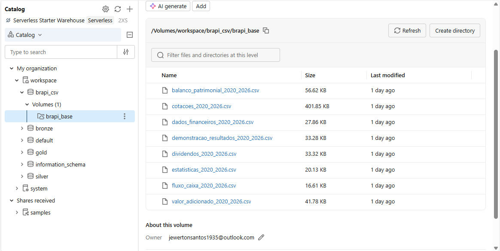

O caminho utilizado no Databricks foi:

`/Volumes/workspace/brapi_csv/brapi_base/`

A partir dos arquivos armazenados no Volume, os dados foram carregados utilizando Apache Spark. Os arquivos foram lidos considerando a primeira linha como cabeçalho e com inferência de tipos.

As imagens abaixo são a leitura de cada tabela e carga na camada bronze.

--Cotações

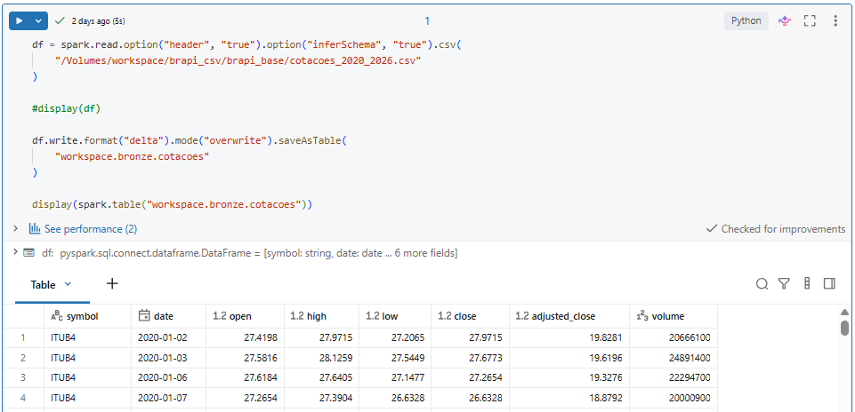

--Estatísticas
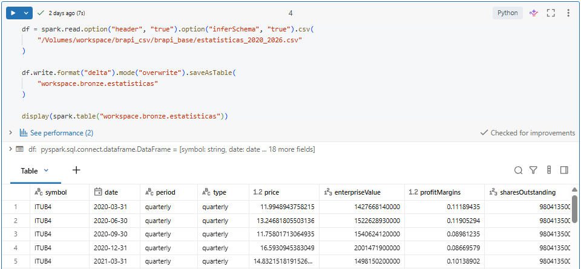

--Dados Financeiros
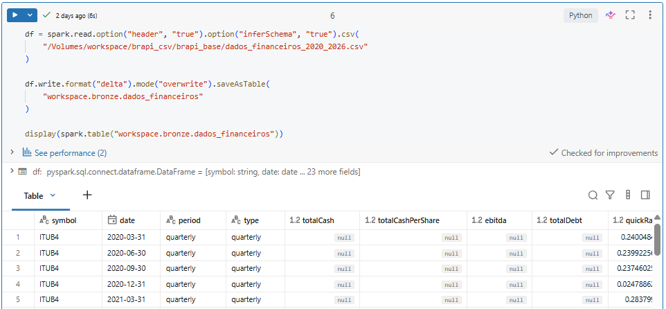

--Balanço Patrimonial
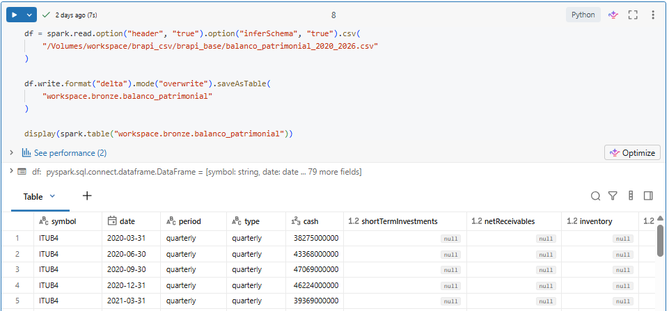

--Demonstração Resultados
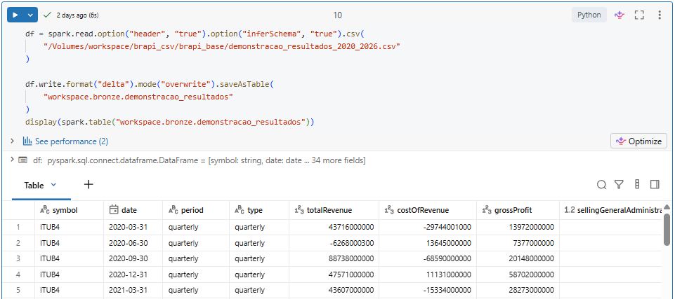

--Fluxo Caixa
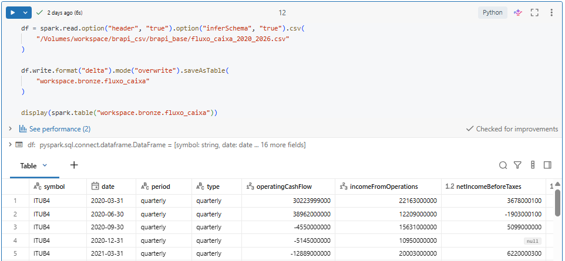

--Valor Adicionado
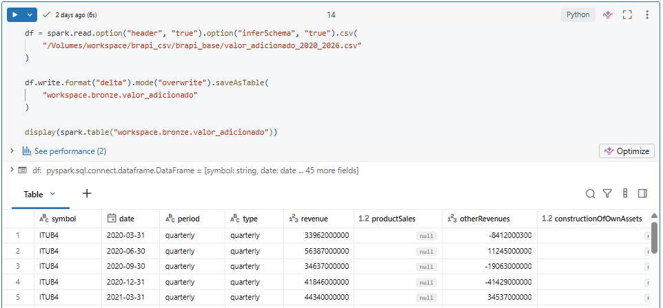

--Dividendos
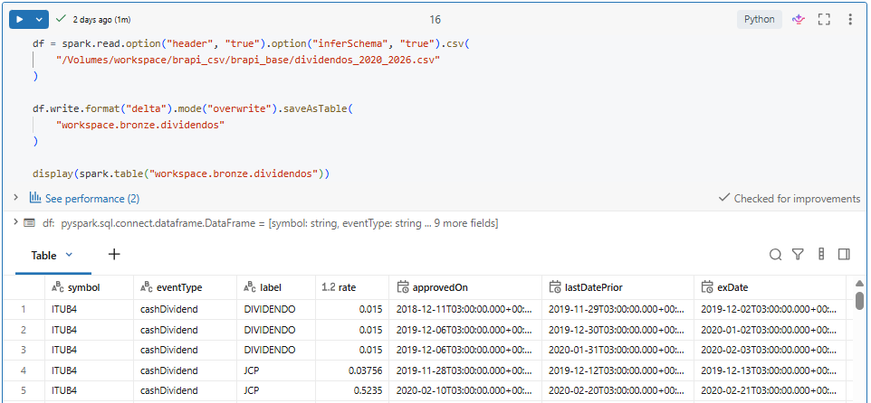

Após a leitura, os dados foram persistidos no formato Delta na camada Bronze do Databricks.

As tabelas foram organizadas no catálogo `workspace`, no schema `bronze`, mantendo uma correspondência com os principais conjuntos de dados coletados:

| Tabela Bronze | Origem |
|---|---|
| `workspace.bronze.cotacoes` | Cotações |
| `workspace.bronze.estatisticas` | Estatísticas |
| `workspace.bronze.dados_financeiros` | Dados financeiros |
| `workspace.bronze.balanco_patrimonial` | Balanço patrimonial |
| `workspace.bronze.demonstracao_resultados` | Demonstração de resultados |
| `workspace.bronze.fluxo_caixa` | Fluxo de caixa |
| `workspace.bronze.valor_adicionado` | Valor adicionado |
| `workspace.bronze.dividendos` | Dividendos e proventos |

A camada Bronze mantém os dados próximos à estrutura original dos arquivos coletados, servindo como base para as etapas posteriores de tratamento e transformação.

## 4. Modelagem e Catálogo de Dados (Etapa 4.3)

A modelagem dos dados foi realizada utilizando uma arquitetura medalhão, dividida em três camadas: Bronze, Silver e Gold.

A organização em camadas permite separar os dados brutos das etapas de tratamento e das informações preparadas para análise.

### 4.1 Camada Bronze

A camada Bronze armazena os dados provenientes dos arquivos CSV, mantendo uma estrutura próxima aos dados coletados originalmente.

As tabelas Bronze utilizadas no projeto são:

| Tabela | Descrição |
|---|---|
| `workspace.bronze.cotacoes` | Histórico de cotações das ações |
| `workspace.bronze.estatisticas` | Indicadores e estatísticas de mercado |
| `workspace.bronze.dados_financeiros` | Indicadores financeiros das empresas |
| `workspace.bronze.balanco_patrimonial` | Informações patrimoniais |
| `workspace.bronze.demonstracao_resultados` | Receitas, despesas e resultados |
| `workspace.bronze.fluxo_caixa` | Informações de fluxo de caixa |
| `workspace.bronze.valor_adicionado` | Informações de geração e distribuição de valor |
| `workspace.bronze.dividendos` | Dividendos, JCP e outros eventos de proventos |

Esta imagem mostra as tabelas carregadas na camada bronze.

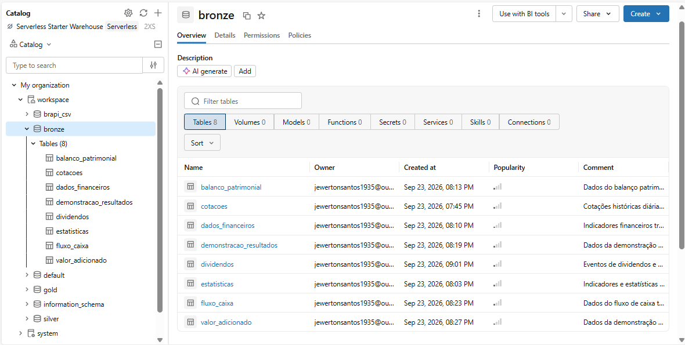

### 4.2 Camada Silver

A camada Silver foi utilizada para realizar a limpeza, seleção e padronização dos dados necessários para a análise.

Nessa etapa foram mantidas somente as colunas necessárias para os indicadores utilizados no projeto, reduzindo a quantidade de informações que precisavam ser processadas nas etapas seguintes.

As tabelas Silver utilizadas foram:

| Tabela | Descrição |
|---|---|
| `workspace.silver.cotacoes` | Cotações utilizadas para análise de preços |
| `workspace.silver.estatisticas` | Indicadores de mercado necessários para a análise |
| `workspace.silver.dados_financeiros` | Indicadores financeiros utilizados nos critérios |
| `workspace.silver.demonstracao_resultados` | Dados de receita, lucro e lucro por ação |
| `workspace.silver.dividendos` | Eventos de dividendos e proventos utilizados no cálculo histórico |

Esta imagem mostra as tabelas carregadas na camada silver.
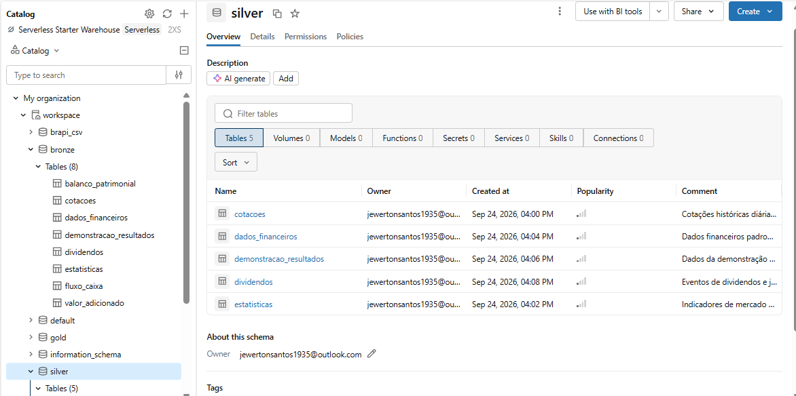

As tabelas de balanço patrimonial, fluxo de caixa e valor adicionado não foram transformadas para a camada Silver, pois os dados necessários para os critérios definidos no MVP já estavam disponíveis nas demais fontes utilizadas.

### 4.3 Camada Gold

A camada Gold concentra os dados preparados para responder às perguntas de negócio do projeto.

Nessa camada são realizados os cruzamentos, cálculos e agregações necessários para gerar os indicadores fundamentalistas.

As principais tabelas Gold são:

| Tabela | Descrição |
|---|---|
| `workspace.gold.analise_acoes` | Indicadores fundamentalistas consolidados das empresas |
| `workspace.gold.crescimento_lucros` | Dados utilizados para cálculo do crescimento dos lucros |
| `workspace.gold.criterios_acoes` | Aplicação dos critérios definidos para a análise |

Esta imagem mostra as tabelas carregadas na camada gold.
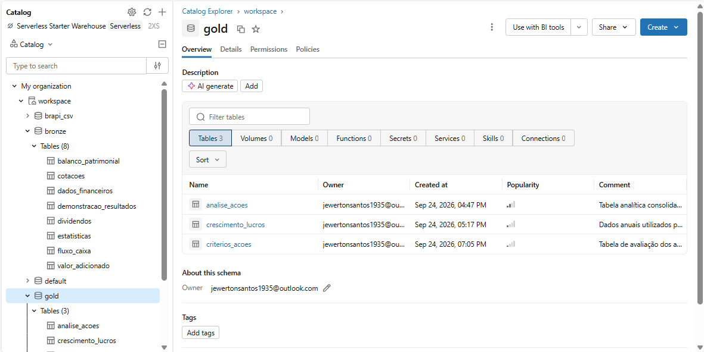

Entre os indicadores calculados ou consolidados na camada Gold estão:

- preço atual;
- P/L;
- P/VP;
- P/VP × P/L;
- lucro por ação (EPS);
- valor patrimonial por ação;
- margem líquida;
- ROE;
- EBITDA;
- dívida total;
- caixa;
- dívida líquida;
- dívida líquida / EBITDA;
- dividendos médios dos últimos cinco anos;
- dividend yield médio dos últimos cinco anos;
- crescimento do lucro em cinco anos;
- preço teto pelo método de Bazin;
- valor justo pelo método de Graham.

### 4.4 Catálogo de Dados

O catálogo de dados foi desenvolvido utilizando os recursos de catálogo e documentação disponíveis no Databricks.

Foram adicionadas descrições às tabelas e às colunas utilizadas na análise, permitindo identificar o significado dos dados, sua finalidade e sua relação com os critérios do projeto.

A imagem abaixo demonstra a documentação da tabela `workspace.gold.criterios_acoes` e de suas respectivas colunas no catálogo do Databricks.
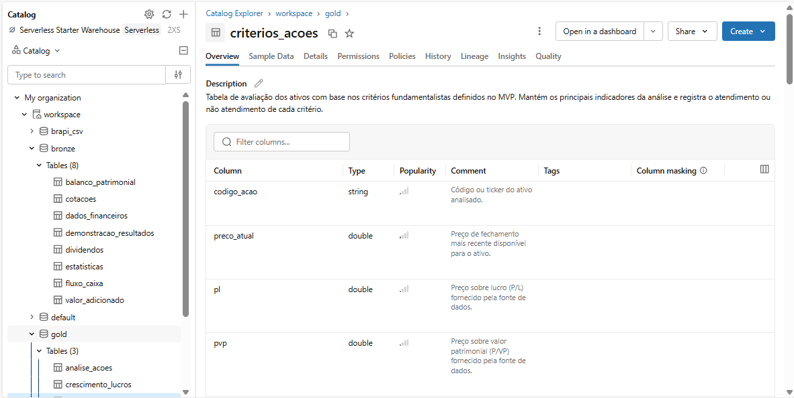
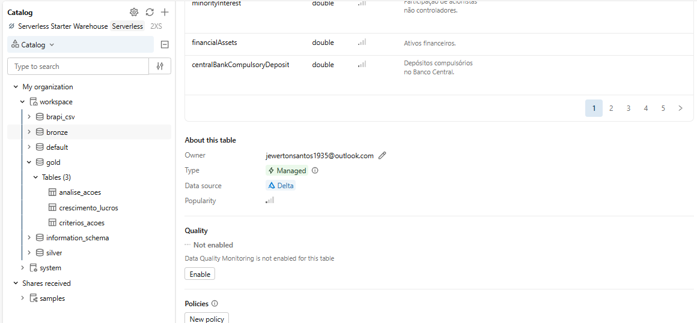

Também foram verificados os valores de domínio utilizados nas classificações dos critérios, como:

- `ATENDE`;
- `NÃO ATENDE`;
- `SEM DADO`.

A imagem abaixo mostra um exemplo do registro do domínio.
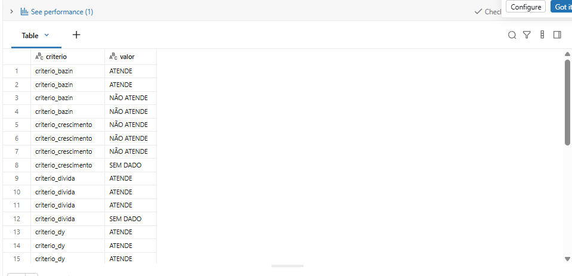

A documentação das tabelas e colunas pode ser consultada diretamente no catálogo do Databricks.

### 4.5 Linhagem dos dados

A linhagem do projeto segue o fluxo:

BRAPI → Python → arquivos CSV → Volume do Databricks → Bronze → Silver → Gold → Análise Fundamentalista.

A imagem abaixo demonstra a linhagem das tabelas no Databricks, permitindo visualizar as relações de origem e dependência entre as camadas do pipeline.
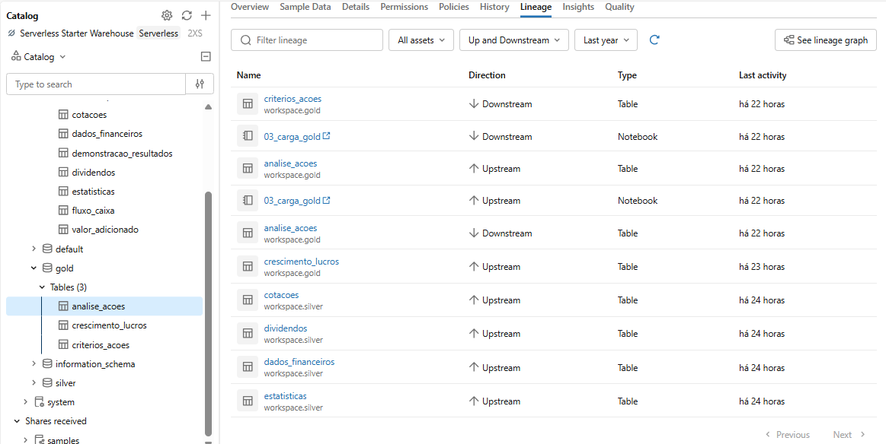

Essa estrutura permite acompanhar a origem dos dados e as transformações realizadas ao longo do pipeline.

## 5. Pipeline de Dados (Etapa 4.4)

O pipeline de dados foi organizado utilizando as três camadas da arquitetura medalhão: Bronze, Silver e Gold.

O processamento foi dividido em notebooks no Databricks, permitindo separar as etapas de carga, tratamento e análise dos dados.

### 5.1 Organização do pipeline

O fluxo de processamento utilizado no projeto é:

BRAPI → Python → CSV → Volume → Bronze → Silver → Gold → Análise Fundamentalista

A coleta inicial dos dados é realizada pelo script Python `src/python/dados_corrigido.py`.

Após a geração dos arquivos CSV, eles são armazenados no Volume do Databricks. Os arquivos são então utilizados como origem para a carga da camada Bronze.

A partir da Bronze, os dados necessários são selecionados e tratados na camada Silver. Por fim, a camada Gold realiza os cálculos e cruzamentos necessários para responder às perguntas de negócio.

### 5.2 Notebooks utilizados

O pipeline foi organizado nos seguintes notebooks:

| Notebook | Função |
|---|---|
| `notebooks/bronze/01_carga_bronze` | Leitura dos arquivos CSV e criação das tabelas Bronze |
| `notebooks/silver/02_carga_silver` | Seleção, tratamento e criação das tabelas Silver |
| `notebooks/gold/03_carga_gold` | Cálculo dos indicadores e criação das tabelas Gold |
| `notebooks/gold/04_DataCatalog` | Documentação das tabelas e colunas no catálogo de dados |

Os notebooks contêm as operações necessárias de processamento utilizando Spark, Python e SQL.

####Evidência de execução da camada bronze.

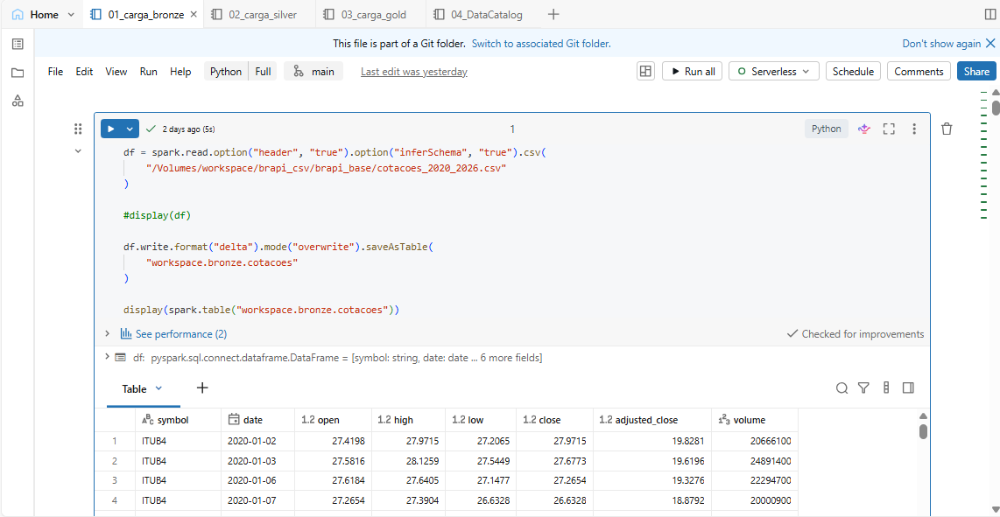

####Evidência de execução da camada silver.

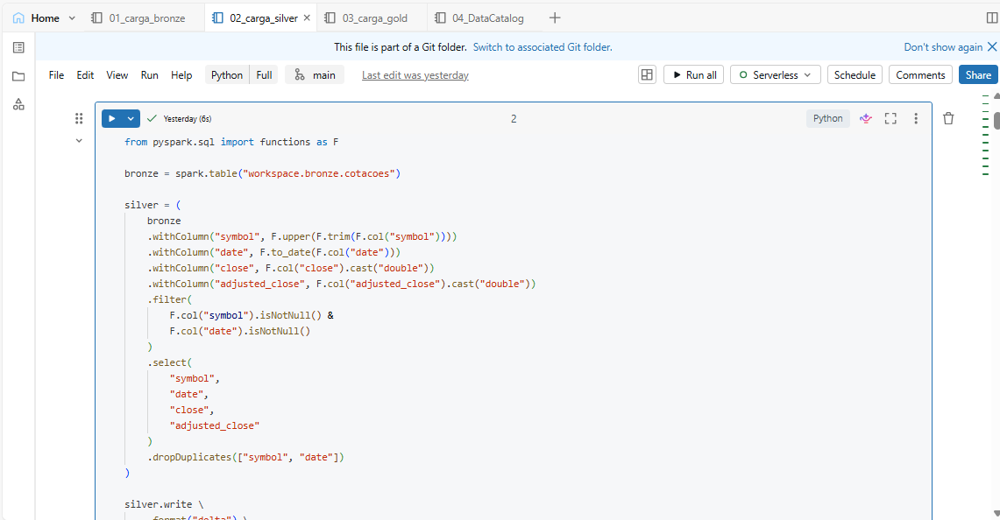
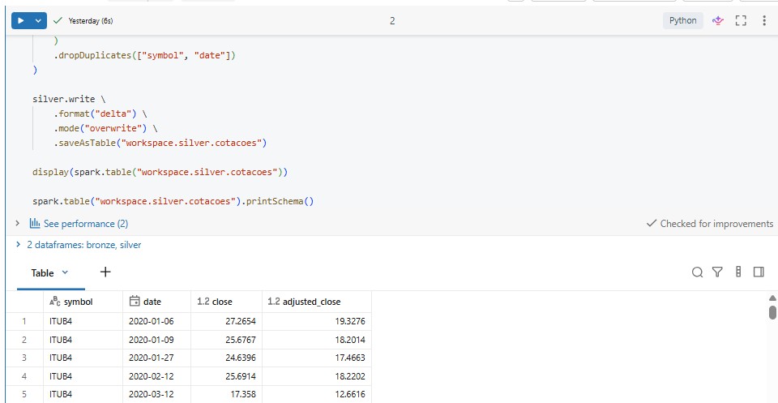

####Evidência de execução da camada gold.
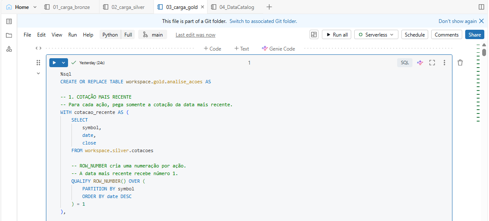
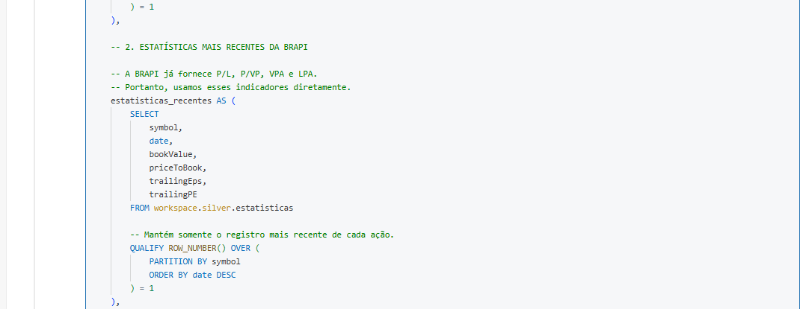
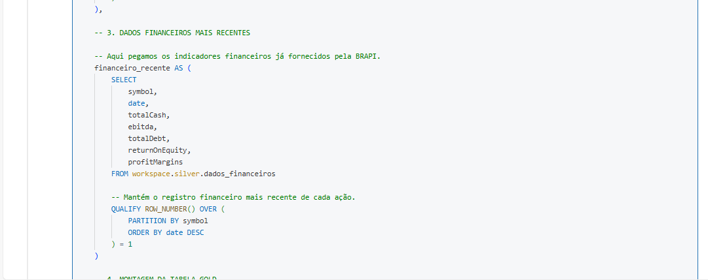
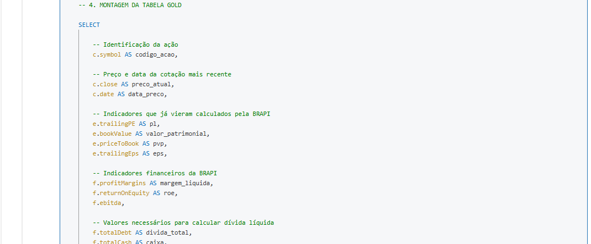
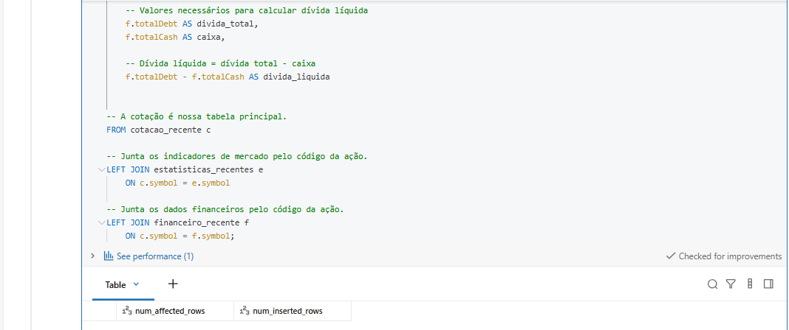
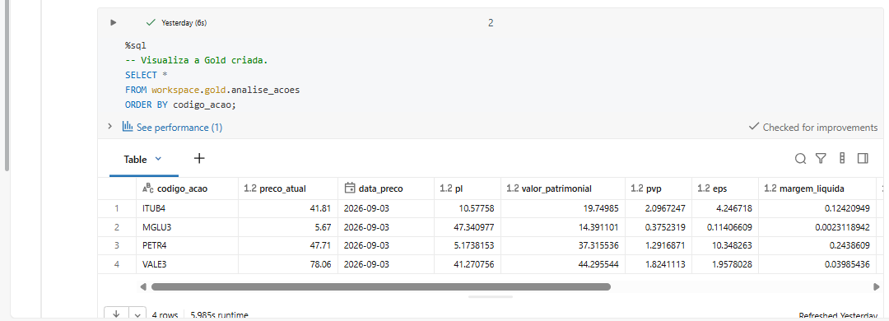

### 5.3 Persistência dos dados

As tabelas processadas são persistidas no Unity Catalog do Databricks utilizando o catálogo `workspace`.

A organização utilizada é:

- `workspace.bronze` — dados carregados a partir dos arquivos brutos;
- `workspace.silver` — dados tratados e selecionados;
- `workspace.gold` — dados consolidados para análise.

As tabelas são armazenadas no formato Delta, permitindo sua persistência e utilização nas etapas seguintes do pipeline.

### 5.4 Versionamento

O código e os notebooks utilizados no projeto foram organizados em um Git Folder no Databricks e vinculados ao repositório GitHub do projeto.

A estrutura utilizada para o versionamento inclui:

- `src/python/` — scripts de coleta;
- `notebooks/bronze/` — notebooks da camada Bronze;
- `notebooks/silver/` — notebooks da camada Silver;
- `notebooks/gold/` — notebooks da camada Gold;
- `documentacao/` — documentação do projeto.

Os arquivos CSV brutos não fazem parte do repositório GitHub. Eles permanecem armazenados no Volume do Databricks, enquanto o GitHub mantém os códigos, notebooks e documentação necessários para reproduzir o pipeline.

A imagem mostra a estrutura Git.
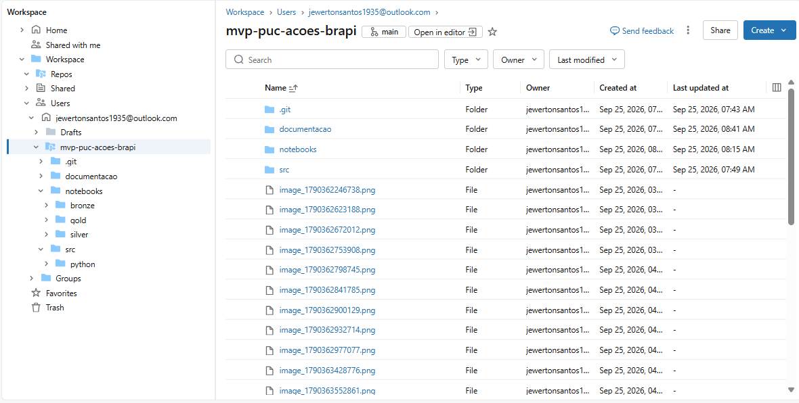

## 6. Qualidade de Dados (Etapa 4.5)

Durante o desenvolvimento do pipeline foram identificados alguns problemas e limitações nos dados disponibilizados pela fonte. Esses casos foram tratados de acordo com o objetivo da análise, evitando substituir informações ausentes por valores estimados sem justificativa.

### 6.1 Seleção e padronização dos dados

Na passagem da camada Bronze para a Silver foram selecionadas apenas as colunas necessárias para os critérios definidos no MVP.

Essa etapa reduziu a quantidade de dados utilizados nas análises e manteve nas tabelas Silver somente as informações necessárias para os cálculos e indicadores fundamentalistas.

Também foram realizadas padronizações relacionadas a datas, identificação dos ativos e estrutura dos dados.

### 6.2 Dados ausentes

Foram identificados valores ausentes em alguns indicadores.

O principal caso ocorreu com o ITUB4, para o qual os dados financeiros disponibilizados não apresentaram valores para EBITDA, dívida total e caixa na estrutura utilizada.

Exemplo de colunas nulas que vieram da base de dados.
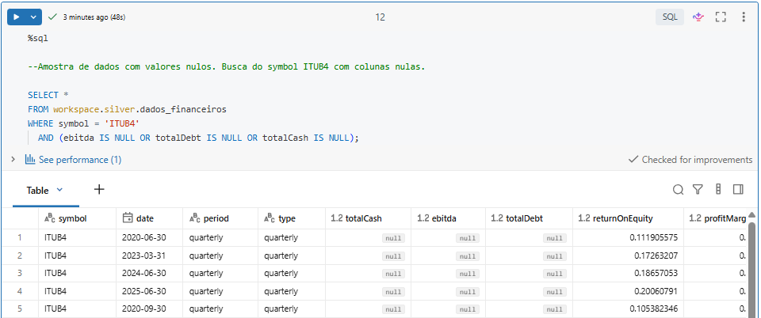

Por esse motivo, não foi calculado o indicador de dívida líquida / EBITDA para o ativo. O resultado foi mantido como dado ausente e posteriormente classificado como `SEM DADO` na tabela de critérios.

### 6.3 Lucro ausente no ITUB4

Também foi identificado que o campo de lucro líquido (`netIncome`) não estava disponível para o ITUB4 na demonstração de resultados utilizada.

Nesse caso, não foi utilizado outro indicador como substituição do lucro líquido, pois isso poderia alterar a definição original da métrica.

Consequentemente, o crescimento do lucro em cinco anos não foi calculado para o ITUB4 e o critério correspondente foi classificado como `SEM DADO`.

### 6.4 Crescimento dos lucros

Para o cálculo do crescimento dos lucros foram utilizados os resultados anuais de 2021 a 2025.

O ano de 2020 não foi utilizado nesse cálculo porque os dados disponíveis para esse período não representam um ano completo de resultados.

Foi calculado o CAGR do lucro entre 2021 e 2025 quando havia valores inicial e final positivos.

A imagem evidencia o resultado do crescimento dos lucros calculados.
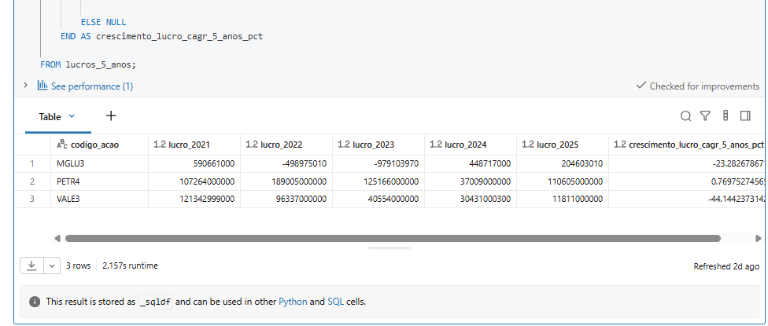

Também foi identificada uma limitação importante: algumas empresas apresentaram períodos com prejuízo entre o início e o final da série. Portanto, embora o CAGR possa ser matematicamente calculado quando os valores inicial e final permitem o cálculo, ele não representa necessariamente uma trajetória de crescimento contínuo dos lucros.

### 6.5 Dados de dividendos

Os dados de dividendos possuem diferentes tipos de eventos, incluindo dividendos e juros sobre capital próprio (JCP).

Para a análise foram considerados os eventos de proventos disponíveis no período e realizada uma deduplicação utilizando o ativo, tipo de evento, valor do provento e data correspondente.

Evidencia dos dados obtidos de dividendos para a análise.
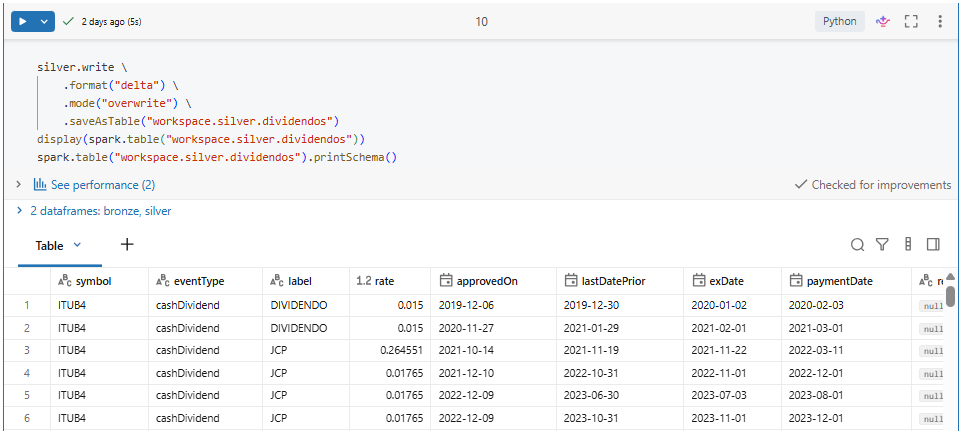

O dividend yield histórico foi calculado utilizando os proventos anuais e os preços das ações, considerando a média dos cinco anos analisados.

### 6.6 Classificação dos critérios

Quando os dados necessários para um critério estavam disponíveis, o resultado foi classificado conforme os limites definidos no projeto:

- `ATENDE` — o indicador atende ao critério estabelecido;
- `NÃO ATENDE` — o indicador não atende ao critério estabelecido;
- `SEM DADO` — não existem dados suficientes para realizar a avaliação.

Essa classificação evita considerar um dado ausente como se fosse um resultado negativo ou positivo.

### 6.7 Limitações identificadas

As principais limitações encontradas foram:

- disponibilidade diferente de indicadores entre as empresas;
- dados ausentes em determinados períodos;
- diferenças na estrutura dos dados financeiros;
- existência de períodos com prejuízo no cálculo do crescimento dos lucros;
- comparação entre empresas de setores econômicos diferentes;
- dependência dos dados disponibilizados pela BRAPI.

Essas limitações foram mantidas explícitas no projeto para evitar conclusões baseadas em dados que não estavam disponíveis ou que não fossem comparáveis diretamente.

## 7. Análise de Dados (Etapa 4.5)

A análise foi realizada a partir dos dados consolidados na camada Gold, principalmente na tabela `workspace.gold.criterios_acoes`.

Os valores apresentados correspondem aos dados disponíveis até a última cotação utilizada na análise, em 03/09/2026.

### 7.1 As empresas estão pagando bons dividendos?

O critério definido foi um dividend yield médio dos últimos cinco anos de pelo menos 6%.

| Empresa | Dividendos médios por ação (R$) | DY médio 5 anos | Critério |
|---|---:|---:|---|
| ITUB4 | 2,07 | 6,93% | ATENDE |
| MGLU3 | 0,16 | 1,72% | NÃO ATENDE |
| PETR4 | 7,83 | 27,08% | ATENDE |
| VALE3 | 8,26 | 11,12% | ATENDE |

Portanto, pelos critérios definidos, ITUB4, PETR4 e VALE3 atingiram o dividend yield médio mínimo de 6%. MGLU3 não atingiu o limite estabelecido.

### 7.2 As empresas estão com boa margem de lucros?

Para essa avaliação foram considerados a margem líquida e o ROE, com valor mínimo de 10% para cada indicador.

| Empresa | Margem líquida | ROE | Critério |
|---|---:|---:|---|
| ITUB4 | 12,42% | 22,01% | ATENDE |
| MGLU3 | 0,23% | 0,79% | NÃO ATENDE |
| PETR4 | 24,39% | 27,81% | ATENDE |
| VALE3 | 3,99% | 4,42% | NÃO ATENDE |

VALE3 e MGLU3 não atingiram o mínimo de 10% em ambos os casos.

### 7.3 As empresas estão crescendo em lucros?

O crescimento foi calculado por meio do CAGR do lucro entre 2021 e 2025.

O critério definido foi crescimento superior a 12% ao ano.

| Empresa | CAGR do lucro 2021–2025 | Critério |
|---|---:|---|
| ITUB4 | SEM DADO | SEM DADO |
| MGLU3 | -23,28% | NÃO ATENDE |
| PETR4 | 0,77% | NÃO ATENDE |
| VALE3 | -44,14% | NÃO ATENDE |

O CAGR utilizado foi baseado no lucro líquido e possivelmente o cálculo feito nas plataformas de investimento seguem outro tipo de lucro. Nos dados obtidos havia lucro antes dos impostos, mas foi optado manter o lucro líquido por ser uma métrica melhor em relação ao desempenho da empresa.

O ITUB4 não possui dados de `netIncome` suficientes na fonte utilizada para realizar o cálculo.

MGLU3 e VALE3 apresentaram CAGR negativo no período. PETR4 apresentou CAGR positivo, porém inferior ao limite de 12% definido para o projeto.

### 7.4 Leva-se pouco tempo para recuperar o investimento nessas empresas?

O indicador utilizado para essa análise foi o P/L. Quanto menor o P/L, menor é a relação entre o preço pago pela ação e o lucro anual por ação.

| Empresa | P/L | Relação preço/lucro |
|---|---:|---|
| ITUB4 | 10,58 | Menor relação |
| MGLU3 | 47,34 | Maior relação |
| PETR4 | 5,17 | Menor relação |
| VALE3 | 41,27 | Maior relação |

Os valores mostram diferenças significativas entre as empresas. PETR4 apresentou P/L de 5,17, ITUB4 de 10,58, VALE3 de 41,27 e MGLU3 de 47,34.  Na comparação, quanto menor a quantidade de anos melhor. Observa-se que apenas a PETR4 leva menos de 10 anos para se recuperar o investimento.

### 7.5 As empresas passam no critério de Graham para preço, valor e lucro?

O primeiro critério de Graham utilizado foi:

P/VP × P/L ≤ 22,5

| Empresa | P/VP | P/L | P/VP × P/L | Critério |
|---|---:|---:|---:|---|
| ITUB4 | 2,10 | 10,58 | 22,18 | ATENDE |
| MGLU3 | 0,38 | 47,34 | 17,76 | ATENDE |
| PETR4 | 1,29 | 5,17 | 6,68 | ATENDE |
| VALE3 | 1,82 | 41,27 | 75,28 | NÃO ATENDE |

ITUB4, MGLU3 e PETR4 ficaram abaixo do limite de 22,5. VALE3 ficou acima do limite.

### 7.6 As empresas podem pagar as dívidas em poucos anos?

Foi utilizada a relação Dívida Líquida / EBITDA. O critério definido foi uma relação inferior a 5.

| Empresa | Dívida líquida / EBITDA | Critério |
|---|---:|---|
| ITUB4 | SEM DADO | SEM DADO |
| MGLU3 | 2,83 | ATENDE |
| PETR4 | 2,28 | ATENDE |
| VALE3 | 3,09 | ATENDE |

MGLU3, PETR4 e VALE3 apresentaram relação inferior a 5. Para ITUB4 não havia dados suficientes de dívida e EBITDA na fonte utilizada.

### 7.7 As empresas estão passando do preço teto?

O preço teto foi calculado pelo método de Bazin:

Preço teto = dividendos médios dos últimos cinco anos / 6%

| Empresa | Preço atual (R$) | Preço teto Bazin (R$) | Situação |
|---|---:|---:|---|
| ITUB4 | 41,81 | 34,42 | PASSANDO DO PREÇO TETO |
| MGLU3 | 5,67 | 2,67 | PASSANDO DO PREÇO TETO |
| PETR4 | 47,71 | 130,53 | NÃO PASSANDO |
| VALE3 | 78,06 | 137,61 | NÃO PASSANDO |

ITUB4 e MGLU3 apresentaram preço atual acima do preço teto calculado. PETR4 e VALE3 apresentaram preço atual abaixo do respectivo preço teto.

### 7.8 As empresas estão no preço justo?

Para esta análise foi utilizado o valor justo de Graham e uma margem de segurança de 25%.

O preço máximo considerado após a aplicação da margem de segurança corresponde a 75% do valor justo calculado.

| Empresa | Preço atual (R$) | Valor justo Graham (R$) | Preço máximo com margem de 25% (R$) | Critério |
|---|---:|---:|---:|---|
| ITUB4 | 41,81 | 43,44 | 32,58 | NÃO ATENDE |
| MGLU3 | 5,67 | 6,08 | 4,56 | NÃO ATENDE |
| PETR4 | 47,71 | 93,21 | 69,91 | ATENDE |
| VALE3 | 78,06 | 44,17 | 33,13 | NÃO ATENDE |

PETR4 foi a única empresa cujo preço atual ficou abaixo do valor máximo após a aplicação da margem de segurança de 25%.

### 7.9 Qual delas seria o melhor ativo para adquirir?

A comparação final considera conjuntamente os critérios definidos no MVP. Como as empresas pertencem a setores econômicos diferentes, o resultado representa apenas a aplicação dos critérios estabelecidos para este exercício.

| Empresa | DY médio 5 anos | Margem líquida | ROE | CAGR do lucro | P/L | P/VP × P/L | Dívida líquida / EBITDA | Preço teto Bazin | Valor justo Graham | Preço máximo Graham -25% |
|---|---:|---:|---:|---:|---:|---:|---:|---:|---:|---:|
| ITUB4 | 6,93% | 12,42% | 22,01% | SEM DADO | 10,58 | 22,18 | SEM DADO | R$ 34,42 | R$ 43,44 | R$ 32,58 |
| MGLU3 | 1,72% | 0,23% | 0,79% | -23,28% | 47,34 | 17,76 | 2,83 | R$ 2,67 | R$ 6,08 | R$ 4,56 |
| PETR4 | 27,08% | 24,39% | 27,81% | 0,77% | 5,17 | 6,68 | 2,28 | R$ 130,53 | R$ 93,21 | R$ 69,91 |
| VALE3 | 11,12% | 3,99% | 4,42% | -44,14% | 41,27 | 75,28 | 3,09 | R$ 137,61 | R$ 44,17 | R$ 33,13 |

Considerando os critérios de aprovação definidos no MVP, o resultado consolidado é:

| Empresa | Dividendos | Margem + ROE | Crescimento | Graham P/VP × P/L | Dívida | Preço teto Bazin | Preço máximo Graham com margem de segurança |
|---|---|---|---|---|---|---|---|
| ITUB4 | ATENDE | ATENDE | SEM DADO | ATENDE | SEM DADO | NÃO ATENDE | NÃO ATENDE |
| MGLU3 | NÃO ATENDE | NÃO ATENDE | NÃO ATENDE | ATENDE | ATENDE | NÃO ATENDE | NÃO ATENDE |
| PETR4 | ATENDE | ATENDE | NÃO ATENDE | ATENDE | ATENDE | ATENDE | ATENDE |
| VALE3 | ATENDE | NÃO ATENDE | NÃO ATENDE | NÃO ATENDE | ATENDE | ATENDE | NÃO ATENDE |

A margem de segurança de 25% é aplicada separadamente ao valor justo calculado pela fórmula de Graham, resultando no preço máximo de 75% do valor justo.

Dentro dos critérios estabelecidos neste MVP, PETR4 apresentou o maior número de critérios atendidos. Essa conclusão é válida para o conjunto de critérios e dados utilizados neste exercício e não representa uma recomendação geral de investimento, especialmente porque as empresas analisadas pertencem a setores econômicos diferentes.

## 8. Autoavaliação

A maior parte dos objetivos definidos no início do projeto foram atingidos. Tive dificuldades para adquirir os dados financeiros de uma fonte, porque grande parte das plataformas só disponibilizam dados da bolsa que são pagos. A BRAPI disponibiliza dados gratuitos apenas de 4 ativos e ainda é de forma limitada. Mesmo ao puxá-los ainda tive problemas, porque os dados do ITAÚ vieram incompletos e não consegui corrigir.

Eu já tinha uma base de analise fundamentalista, então apenas usei um material que eu já havia elaborado para embasar minhas perguntas. O que eu gostaria de fazer idealmente seria puxar dados de vários ativos da bolsa de valores dos últimos 5 anos e fazer comparações entre algumas empresas de mesmo setor para poder aplicar os critérios de análise e compará-las entre os setores. No final, montaria uma carteira de investimento com um ativo por setor. 

Como houve uma limitação de dados, tive que aplicar os critérios nos ativos disponíveis e escolher entre os 4. Acredito que mesmo assim foi possível conseguir informações interessantes e fazer uma análise robusta em cada ativo. A lacuna de informações acabou limitando algumas respostas para a ação do ITAÚ, mas mesmo assim foi possível verificar vários critérios. 

Outro problema foi compreender e estruturar a arquitetura medalhão considerando a base de dados que eu tinha, porque tinha tanto que entender as tabelas trazidas via API, quanto a manipulação de dados que eu deveria fazer para chegar aos cálculos necessários.

Também tive um pouco de problema para entender o código spark e python até a construção das camadas básicas. Em relação ao SQL já tinha alguma familiaridade.

Essas dificuldades contribuíram para ampliar o conhecimento sobre engenharia de dados, modelagem analítica e documentação de projetos de dados em ambiente de nuvem.

Eu aprendi bastante nesse projeto, tanto na utilização do ambiente do databricks, quanto o processo e o uso do github. Nunca havia trabalhado com databricks, então foi muito interessante de aprender e organizar tudo. Em relação ao github eu só havia feito pequenos projetos de código, basicamente aulas que tive. Foi a primeira vez que montei um projeto mais robusto e completo lá, realizando os commits e organizando a estrutura. 

Para o futuro, eu gostaria de conseguir usar dados mais completos e gostaria de tentar trabalhar com uma quantidade maior de ativos para fazer uma análise mais realista. Ainda não sei como vou conseguir esses dados, mas talvez opte por fazer com ativos americanos, que é possível conseguir pela base do yahoo.